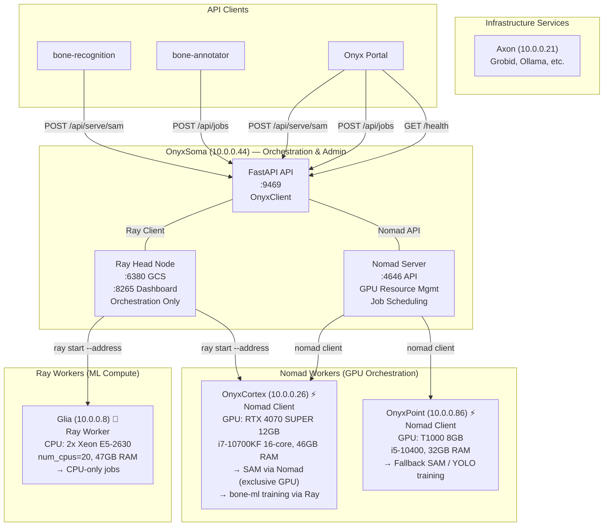
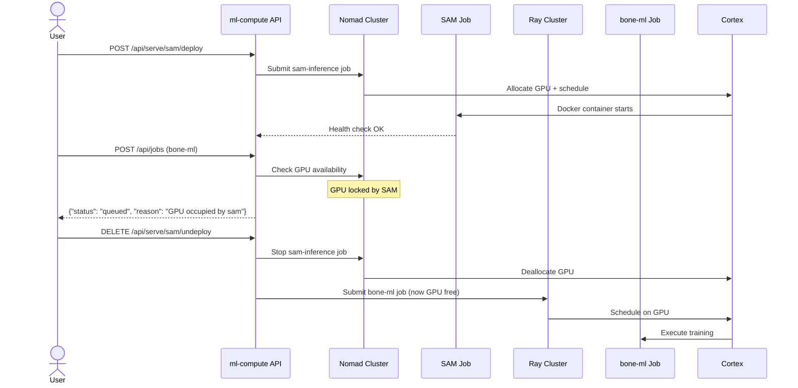
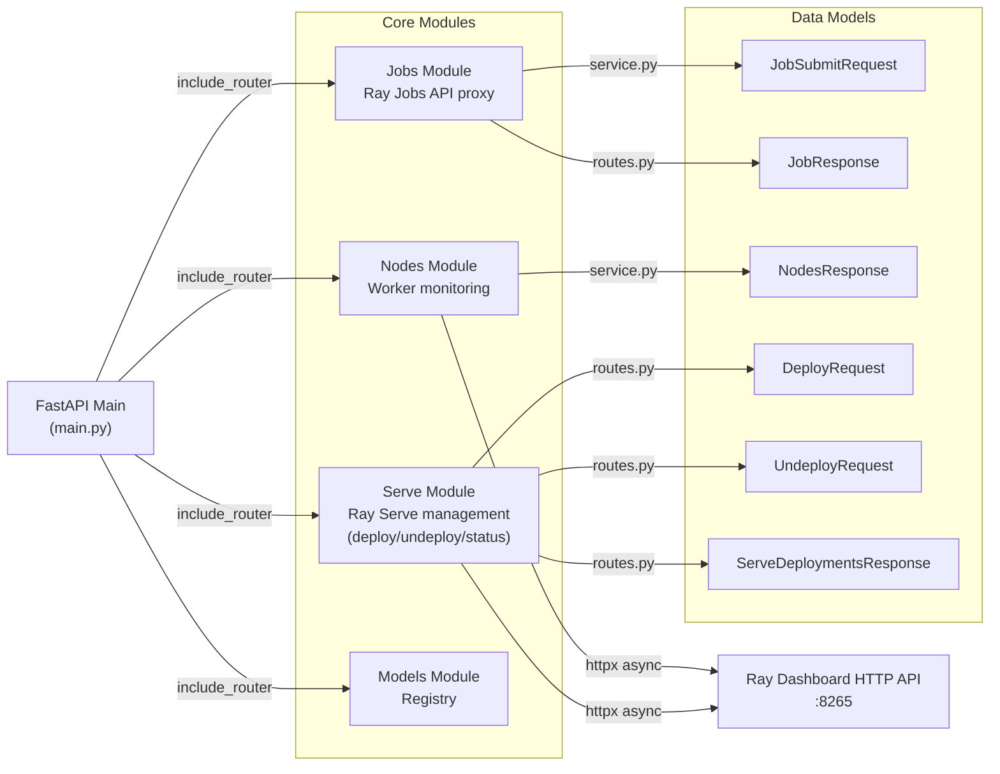
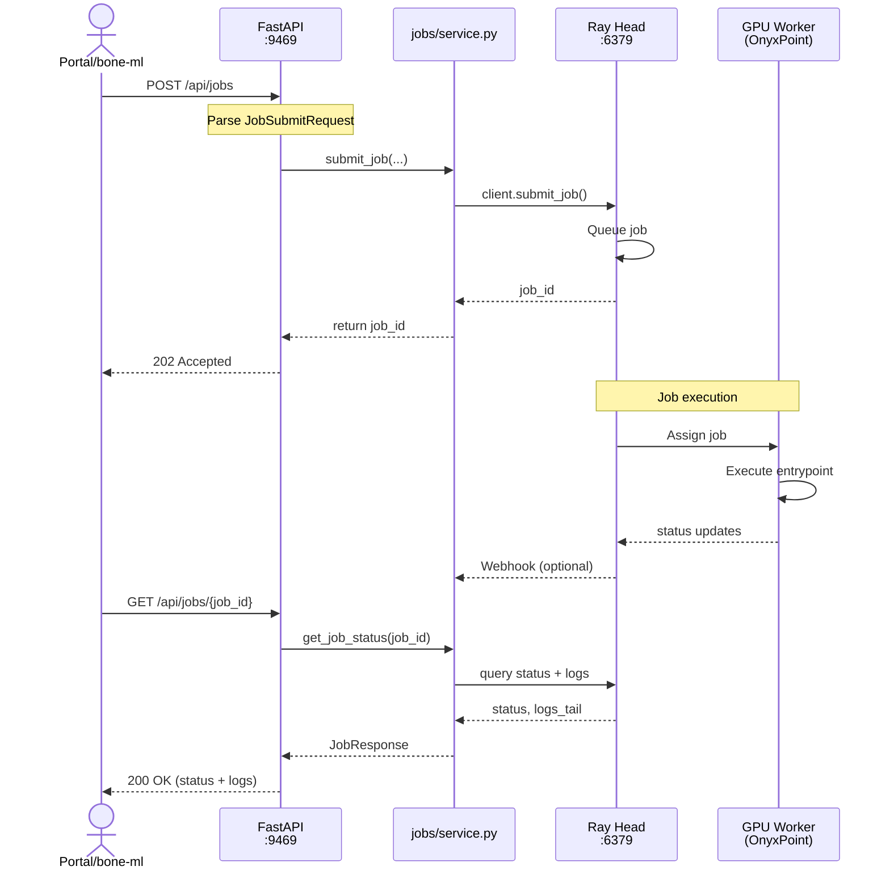

# ml-compute - Architecture Diagram

## Nomad + Ray Hybrid Architecture



### GPU Resource Coordination



## Module Interactions



## Data Flow: Job Submission



## Storage Layout

```
/opt/onyx/skills/ml-compute/
├── docker-compose.yml          # Ray head + FastAPI
├── Dockerfile                  # FastAPI image
├── src/                        # Source code
│   ├── main.py                 # FastAPI app
│   ├── models.py               # Pydantic models
│   └── modules/                # 4 core modules
│       ├── jobs/
│       ├── nodes/
│       ├── serve/
│       └── models/
├── config/                     # Ray configuration
│   ├── ray-config.json         # Cluster settings
│   └── workers.json            # Worker registration
├── models/                     # ML models (backup)
│   ├── bone-annotator/         # YOLO models
│   └── bone-recognition/       # EfficientNet models
└── jobs/                       # Job templates Ray
    ├── __init__.py
    ├── bone-annotator/
    │   ├── __init__.py
    │   ├── train_yolo.py          # YOLOv8 training (ultralytics)
    │   └── README.md               # Doc: env vars, exemples curl
    └── bone-recognition/
        ├── __init__.py
        ├── train_efficientnet.py   # EfficientNet-B0 (Phase A+B)
        └── README.md               # Doc: env vars, exemples curl
```

## Deployment Target

- **Host**: OnyxSoma (10.0.0.44)
- **Run Mode**: service (systemd)
- **Containers**: 2 (Ray head, FastAPI wrapper)
- **Networks**: host (direct access to workers)
- **Ports**: 9469 (API), 6379 (Ray), 8265 (Dashboard), 8000 (Serve)
