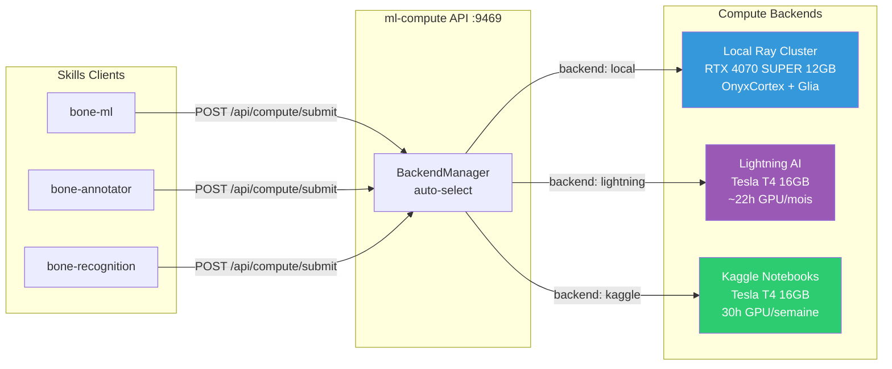
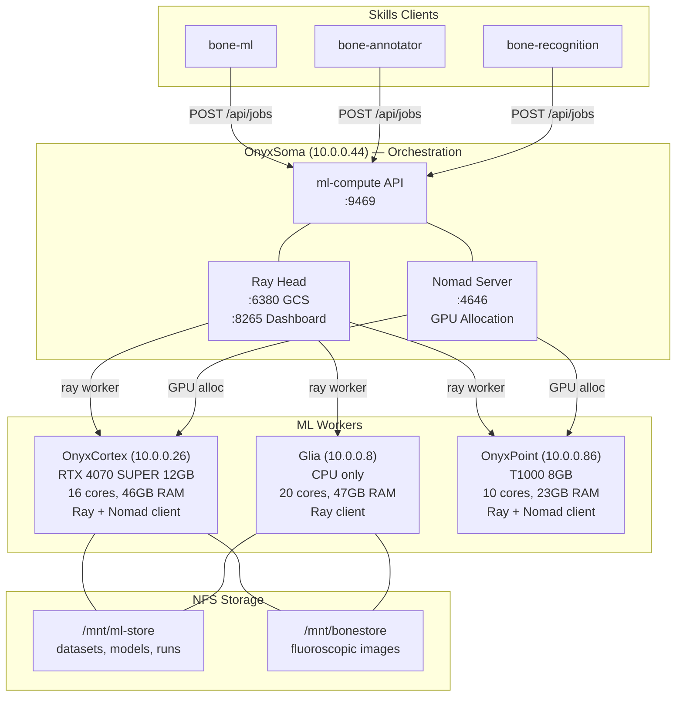
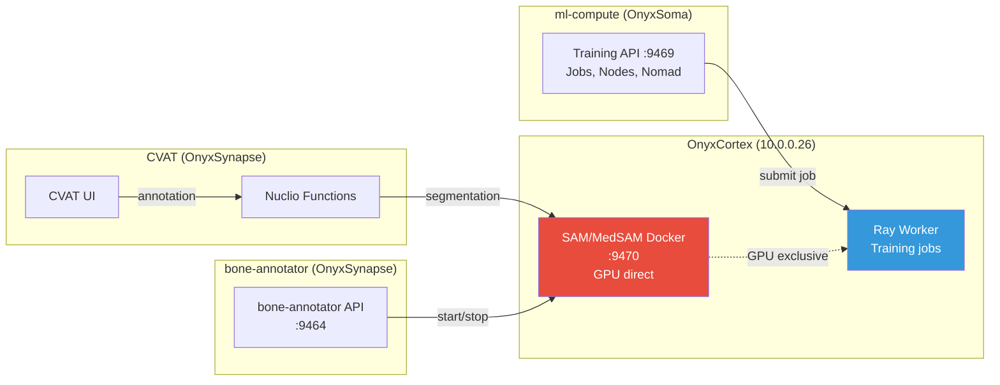
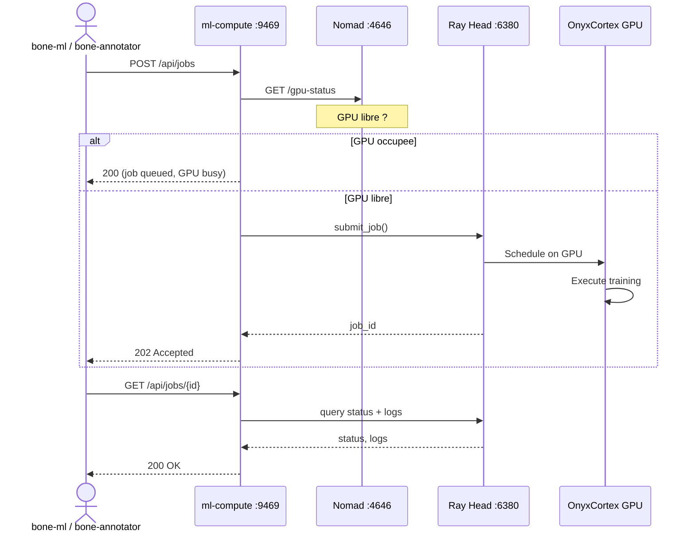
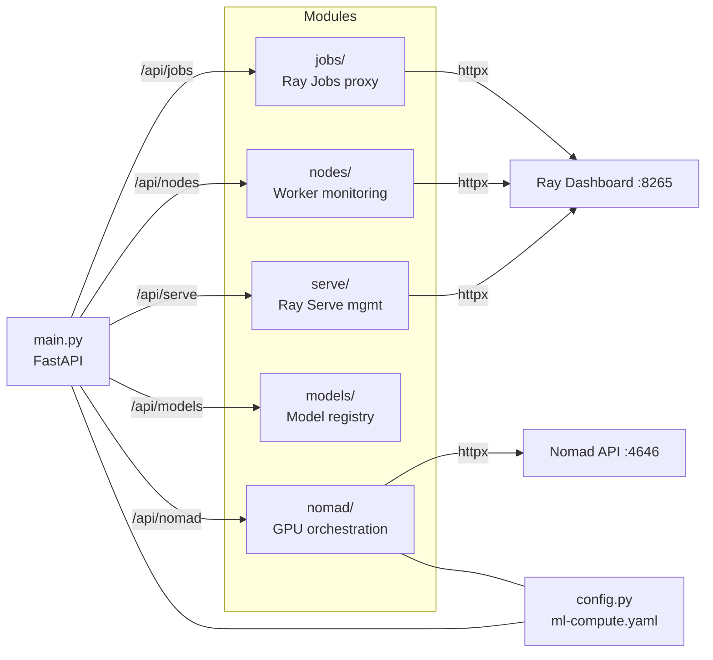

# ml-compute - Architecture Diagram

## Multi-Backend Compute

---

## Cluster Ray + Nomad

## Separation SAM / ml-compute

**Point cle** : SAM et Ray Worker partagent le meme GPU sur OnyxCortex.
Il faut stopper SAM avant de lancer un training job (coordination manuelle via bone-annotator).

## Job Submission Flow

## Module Interactions

