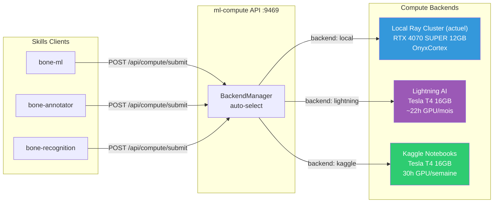
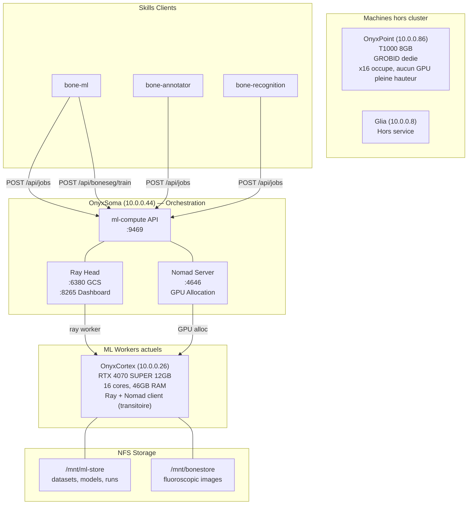
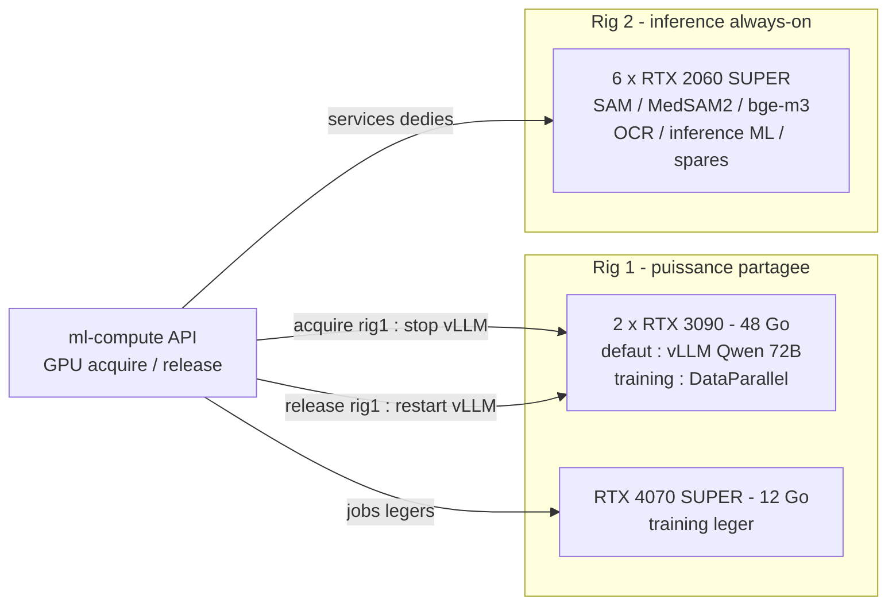
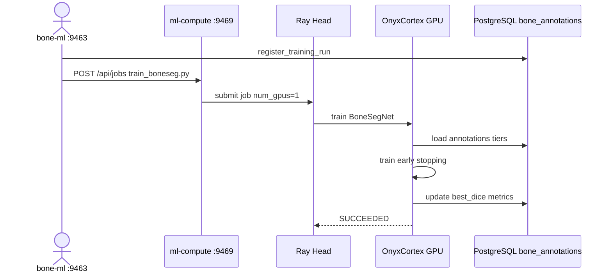
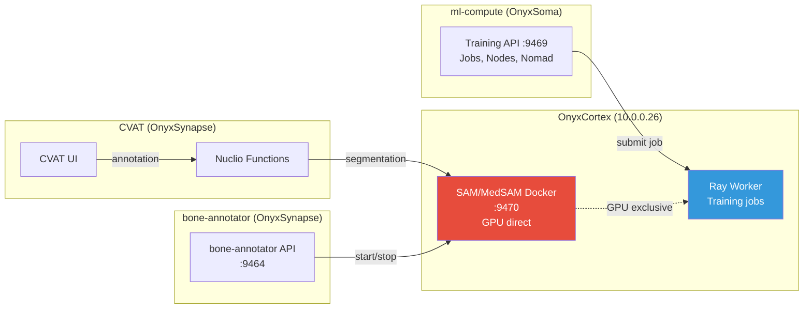
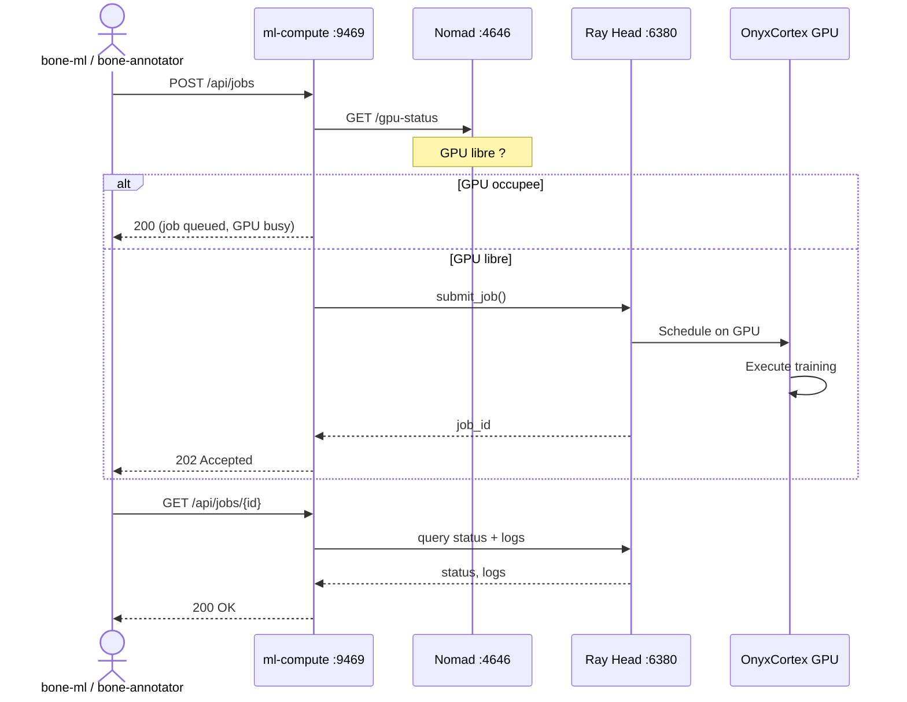
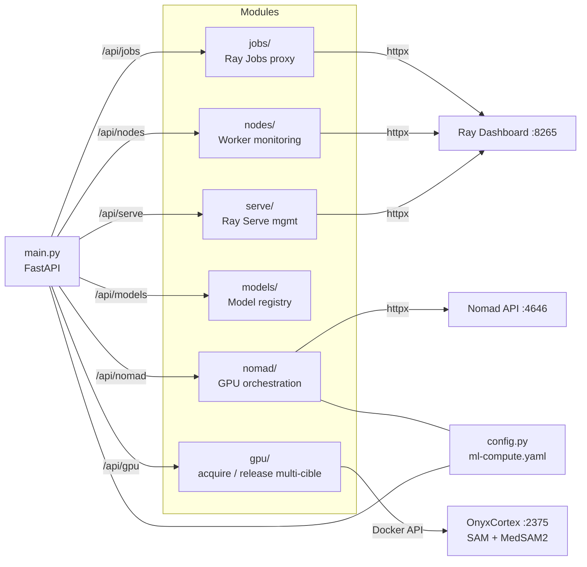

# ml-compute - Architecture Diagram

## Multi-Backend Compute

```mermaid
graph LR
    subgraph Clients["Skills Clients"]
        BoneML["bone-ml"]
        BoneAnn["bone-annotator"]
        BoneRec["bone-recognition"]
    end

    subgraph mlcompute["ml-compute API :9469"]
        Router["BackendManager<br/>auto-select"]
    end

    subgraph Backends["Compute Backends"]
        Local["Local Ray Cluster (actuel)<br/>RTX 4070 SUPER 12GB<br/>OnyxCortex"]
        Lightning["Lightning AI<br/>Tesla T4 16GB<br/>~22h GPU/mois"]
        Kaggle["Kaggle Notebooks<br/>Tesla T4 16GB<br/>30h GPU/semaine"]
    end

    BoneML -->|POST /api/compute/submit| Router
    BoneAnn -->|POST /api/compute/submit| Router
    BoneRec -->|POST /api/compute/submit| Router

    Router -->|backend: local| Local
    Router -->|backend: lightning| Lightning
    Router -->|backend: kaggle| Kaggle

    style Local fill:#3498db,color:#fff
    style Lightning fill:#9b59b6,color:#fff
    style Kaggle fill:#2ecc71,color:#fff
```

---

## Cluster Ray + Nomad

```mermaid
graph TB
    subgraph Soma["OnyxSoma (10.0.0.44) — Orchestration"]
        API["ml-compute API<br/>:9469"]
        RayHead["Ray Head<br/>:6380 GCS<br/>:8265 Dashboard"]
        NomadServer["Nomad Server<br/>:4646<br/>GPU Allocation"]
        API --- RayHead
        API --- NomadServer
    end

    subgraph Workers["ML Workers actuels"]
        Cortex["OnyxCortex (10.0.0.26)<br/>RTX 4070 SUPER 12GB<br/>16 cores, 46GB RAM<br/>Ray + Nomad client (transitoire)"]
    end

    subgraph Dedicated["Machines hors cluster"]
        OPoint["OnyxPoint (10.0.0.86)<br/>T1000 8GB<br/>GROBID dedie<br/>x16 occupe, aucun GPU pleine hauteur"]
        Glia["Glia (10.0.0.8)<br/>Hors service"]
    end

    subgraph Storage["NFS Storage"]
        MLStore["/mnt/ml-store<br/>datasets, models, runs"]
        BoneStore["/mnt/bonestore<br/>fluoroscopic images"]
    end

    RayHead -->|ray worker| Cortex
    NomadServer -->|GPU alloc| Cortex

    Cortex --- MLStore
    Cortex --- BoneStore

    subgraph Clients["Skills Clients"]
        BoneML["bone-ml"]
        BoneAnnotator["bone-annotator"]
        BoneRec["bone-recognition"]
    end

    BoneML -->|POST /api/jobs| API
    BoneAnnotator -->|POST /api/jobs| API
    BoneRec -->|POST /api/jobs| API
    BoneML -->|POST /api/boneseg/train| API
```

## Rigs IA cibles

```mermaid
graph LR
    API["ml-compute API<br/>GPU acquire / release"]

    subgraph Rig1["Rig 1 - puissance partagee"]
        VLLM["2 x RTX 3090 - 48 Go<br/>defaut : vLLM Qwen 72B<br/>training : DataParallel"]
        Light["RTX 4070 SUPER - 12 Go<br/>training leger"]
    end

    subgraph Rig2["Rig 2 - inference always-on"]
        Services["6 x RTX 2060 SUPER<br/>SAM / MedSAM2 / bge-m3<br/>OCR / inference ML / spares"]
    end

    API -->|acquire rig1 : stop vLLM| VLLM
    API -->|release rig1 : restart vLLM| VLLM
    API -->|jobs legers| Light
    API -->|services dedies| Services
```

## BoneSeg Training Flow

```mermaid
sequenceDiagram
    actor BoneML as bone-ml :9463
    participant API as ml-compute :9469
    participant Ray as Ray Head
    participant Worker as OnyxCortex GPU
    participant PG as PostgreSQL bone_annotations

    BoneML->>PG: register_training_run
    BoneML->>API: POST /api/jobs train_boneseg.py
    API->>Ray: submit job num_gpus=1
    Ray->>Worker: train BoneSegNet
    Worker->>PG: load annotations tiers
    Worker->>Worker: train early stopping
    Worker->>PG: update best_dice metrics
    Worker-->>Ray: SUCCEEDED
```

## Separation SAM / ml-compute

```mermaid
graph LR
    subgraph mlcompute["ml-compute (OnyxSoma)"]
        TrainingAPI["Training API :9469<br/>Jobs, Nodes, Nomad"]
    end

    subgraph boneannotator["bone-annotator (OnyxSynapse)"]
        BA_API["bone-annotator API<br/>:9464"]
    end

    subgraph cortex["OnyxCortex (10.0.0.26)"]
        SAM["SAM/MedSAM Docker<br/>:9470<br/>GPU direct"]
        RayWorker["Ray Worker<br/>Training jobs"]
    end

    subgraph cvat["CVAT (OnyxSynapse)"]
        CVAT_UI["CVAT UI"]
        Nuclio["Nuclio Functions"]
    end

    CVAT_UI -->|annotation| Nuclio
    Nuclio -->|segmentation| SAM
    BA_API -->|start/stop| SAM

    TrainingAPI -->|submit job| RayWorker

    SAM -.->|GPU exclusive| RayWorker

    style SAM fill:#e74c3c,color:#fff
    style RayWorker fill:#3498db,color:#fff
```

**Point cle** : SAM et Ray Worker partagent le meme GPU sur OnyxCortex.
L'API `POST /api/gpu/acquire` stoppe SAM et MedSAM2 avant un training, puis
`POST /api/gpu/release` les relance.

**Protocole CVAT** : Nuclio appelle `POST http://10.0.0.26:9470/api/embed` qui doit
retourner `{blob, shape}` (source : `jobs/sam/sam_server.py`, image `sam-inference`).

## Job Submission Flow

```mermaid
sequenceDiagram
    actor Client as bone-ml / bone-annotator
    participant API as ml-compute :9469
    participant Nomad as Nomad :4646
    participant Ray as Ray Head :6380
    participant Worker as OnyxCortex GPU

    Client->>API: POST /api/jobs
    API->>Nomad: GET /gpu-status
    Note over Nomad: GPU libre ?

    alt GPU occupee
        API-->>Client: 200 (job queued, GPU busy)
    else GPU libre
        API->>Ray: submit_job()
        Ray->>Worker: Schedule on GPU
        Worker->>Worker: Execute training
        Ray-->>API: job_id
        API-->>Client: 202 Accepted
    end

    Client->>API: GET /api/jobs/{id}
    API->>Ray: query status + logs
    Ray-->>API: status, logs
    API-->>Client: 200 OK
```

## Module Interactions

```mermaid
graph LR
    Main["main.py<br/>FastAPI"]

    subgraph Modules
        Jobs["jobs/<br/>Ray Jobs proxy"]
        Nodes["nodes/<br/>Worker monitoring"]
        Serve["serve/<br/>Ray Serve mgmt"]
        Models["models/<br/>Model registry"]
        Nomad["nomad/<br/>GPU orchestration"]
        GPU["gpu/<br/>acquire / release multi-cible"]
    end

    Main -->|/api/jobs| Jobs
    Main -->|/api/nodes| Nodes
    Main -->|/api/serve| Serve
    Main -->|/api/models| Models
    Main -->|/api/nomad| Nomad
    Main -->|/api/gpu| GPU

    RayDash["Ray Dashboard :8265"]
    NomadAPI["Nomad API :4646"]

    Jobs -->|httpx| RayDash
    Nodes -->|httpx| RayDash
    Serve -->|httpx| RayDash
    Nomad -->|httpx| NomadAPI
    GPU -->|Docker API| CortexDocker["OnyxCortex :2375<br/>SAM + MedSAM2"]

    Config["config.py<br/>ml-compute.yaml"]
    Nomad --- Config
    Main --- Config
```
